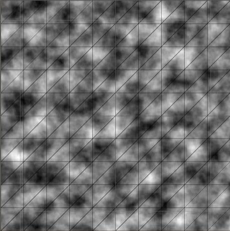
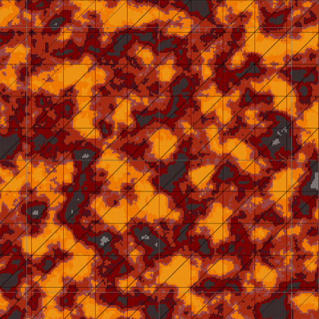
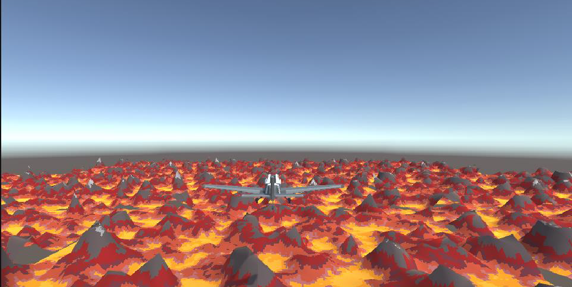

# Terrain_Generation
Aplication generates terrain using height maps, color maps and generating mesh using threads in Unity.
## Description

### Terrain generation process

First, an height map is generated using Perlin noise.

On its basis, a color map is created, on which each color represents a predetermined height value in the range from 0 to 1, where zero means the lowest point and one the highest point.

Based on the color map, a piece of terrain is generated as a mesh. Then an observer was added to the scene in the form of an airplane with a script to move around. The observer has a fixed field of view on the basis of which it is known how many pieces of terrain are to be visible at a given moment. Terrain is infinitely generated by threads, as the spectator moves, those pieces that go beyond line of sight are deactivated and become invisible.

## Images

